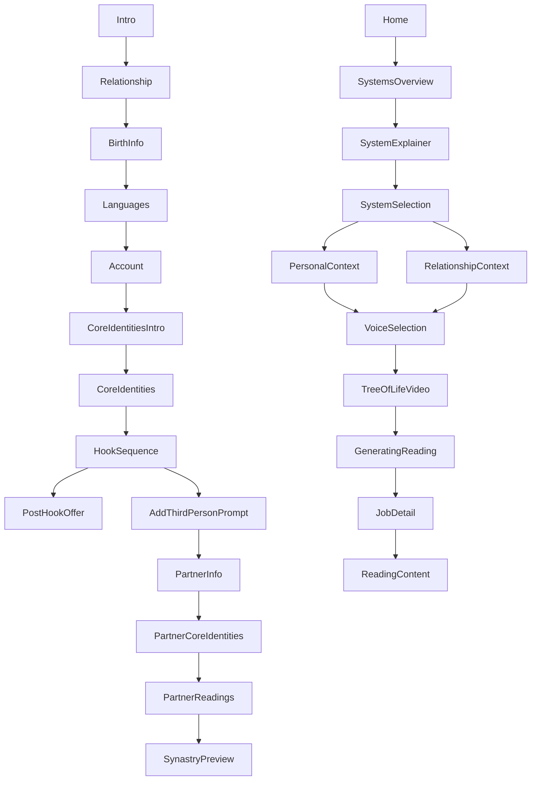

# Screen Flow (Code-Derived)

This map is generated from navigation wiring in:
- `/Users/michaelperinwogenburg/Desktop/big-challenge/1-in-a-billion-v2/src/navigation/RootNavigator.tsx`
- `navigation.navigate(...)` and `navigation.replace(...)` calls under `/Users/michaelperinwogenburg/Desktop/big-challenge/1-in-a-billion-v2/src/screens`

Full edge list CSV:
- `/Users/michaelperinwogenburg/Desktop/big-challenge/1-in-a-billion-v2/docs/screen-flow/edge-list.csv`

Current real simulator screenshot (captured now):
- `/Users/michaelperinwogenburg/Desktop/big-challenge/1-in-a-billion-v2/docs/screen-flow/screenshots/current.png`

## Onboarding Canonical Path

```text
Intro -> Relationship -> BirthInfo -> Languages -> Account -> CoreIdentitiesIntro -> CoreIdentities -> HookSequence -> PostHookOffer
```

Partner branch during onboarding:

```text
HookSequence -> AddThirdPersonPrompt -> PartnerInfo -> PartnerCoreIdentities -> PartnerReadings -> SynastryPreview
```

## Main Reading Flow

```text
Home -> SystemsOverview -> SystemExplainer -> SystemSelection -> (PersonalContext | RelationshipContext) -> VoiceSelection -> TreeOfLifeVideo -> GeneratingReading -> JobDetail -> ReadingContent
```

## Registered Screens

### OnboardingStack
- Intro
- SignIn
- Relationship
- BirthInfo
- Languages
- Account
- CoreIdentitiesIntro
- CoreIdentities
- HookSequence
- AddThirdPersonPrompt
- PartnerInfo
- PartnerCoreIdentities
- PartnerReadings
- SynastryPreview
- PostHookOffer

### MainStack
- Home
- NextStep
- MyLibrary
- ComparePeople
- SystemsOverview
- YourChart
- PeopleList
- PersonProfile
- PersonReadings
- PersonPhotoUpload
- EditBirthData
- SystemExplainer
- PersonalContext
- RelationshipContext
- SystemSelection
- VoiceSelection
- TreeOfLifeVideo
- GeneratingReading
- JobDetail
- ReadingContent
- Gallery
- ChatList
- Chat
- Settings
- PrivacyPolicy
- TermsOfService
- DataPrivacy
- About
- ContactSupport
- AccountDeletion
- PartnerInfo
- PartnerCoreIdentities
- PartnerReadings
- SynastryPreview
- SynastryOptions

## Quick Visual (Structure)



## Notes

- This is code-derived and reliable for navigation wiring.
- It does not include conditional business guards (auth/subscription checks) unless those checks explicitly call navigation.
- When you want the image-based version, I can generate `SCREEN_FLOW_WITH_IMAGES.md` by walking the simulator and capturing each route state.
