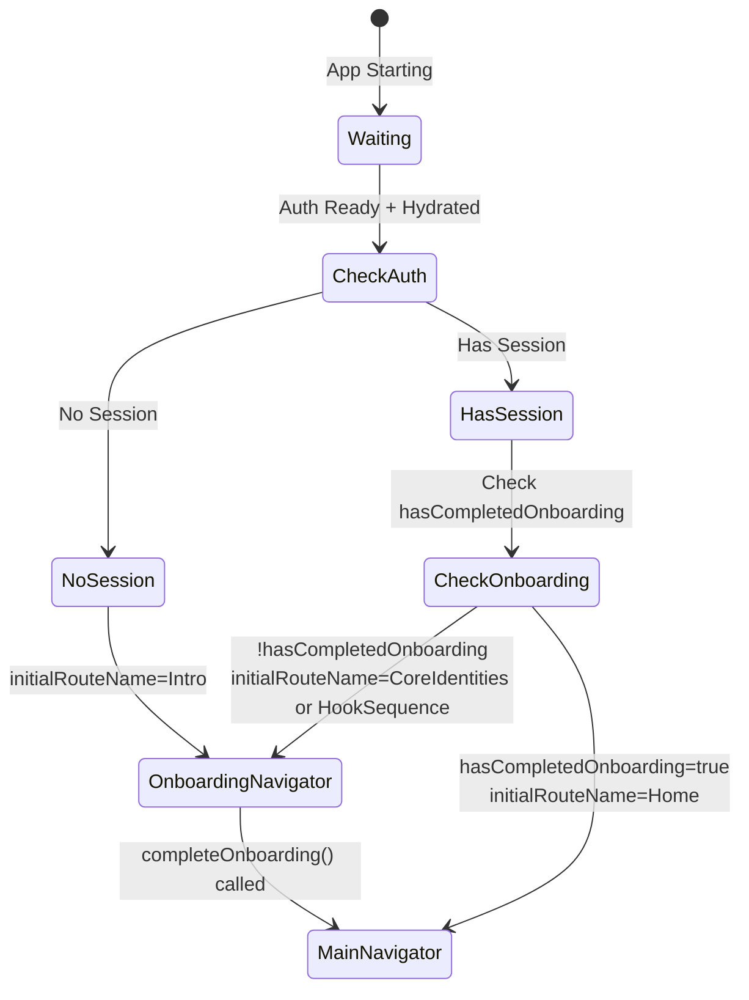
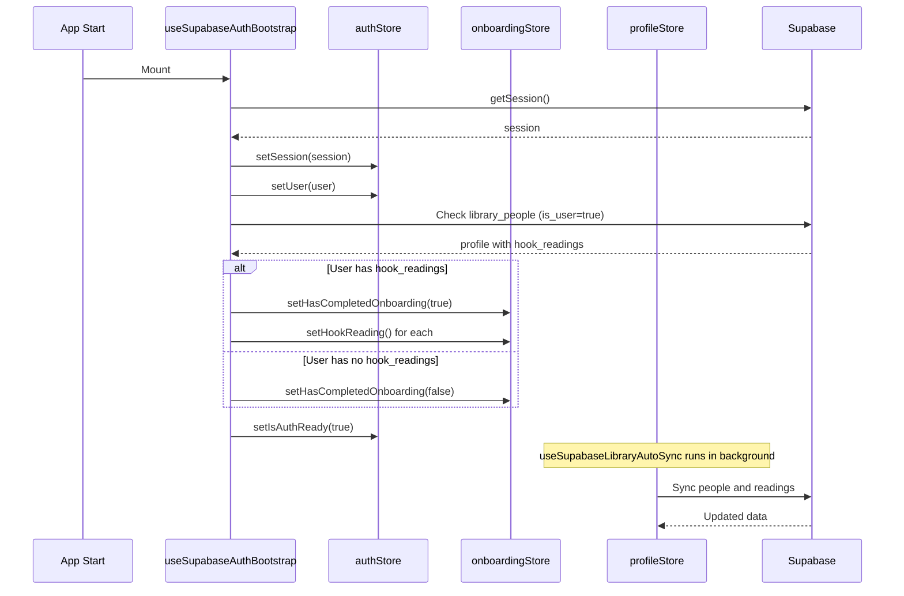
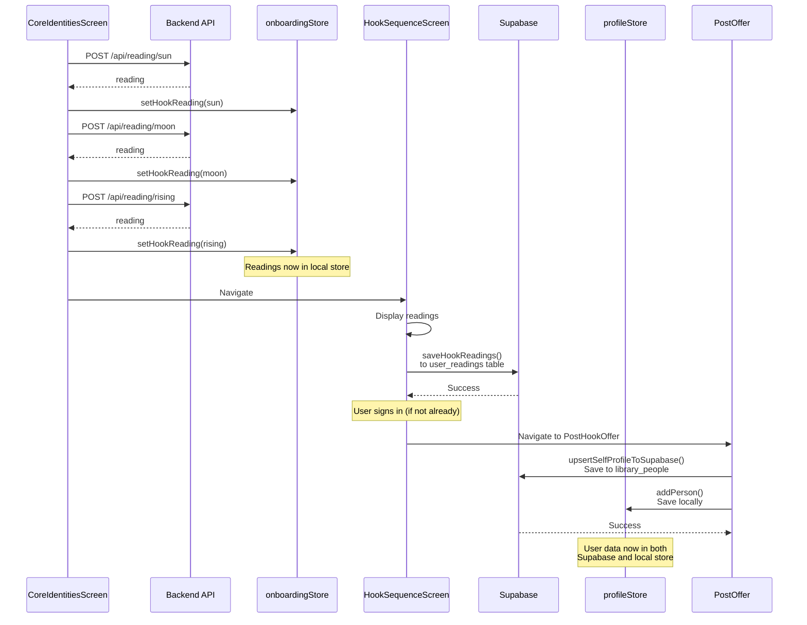
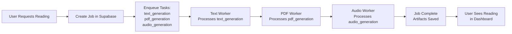

# 1-in-a-Billion - Complete Architecture Documentation

> **Purpose**: This document serves as the single source of truth for understanding the complete app flow, navigation logic, state management, and data persistence. AI agents should reference this document first before making any changes to understand the system architecture.

---

## Table of Contents

1. [Executive Summary](#executive-summary)
2. [Complete User Flow](#complete-user-flow)
3. [Navigation Architecture](#navigation-architecture)
4. [State Management](#state-management)
5. [Data Persistence Flow](#data-persistence-flow)
6. [Onboarding Flow (Detailed)](#onboarding-flow-detailed)
7. [Dashboard Complexity](#dashboard-complexity)
8. [Backend Architecture](#backend-architecture)
9. [Critical Invariants](#critical-invariants)
10. [Common Pitfalls & Solutions](#common-pitfalls--solutions)

---

## Executive Summary

### App Purpose
1-in-a-Billion is a comprehensive astrology app that generates personalized readings using 5 different systems (Western, Vedic, Human Design, Gene Keys, Kabbalah). Users can generate readings for themselves and others, compare compatibility, and build a library of astrological insights.

### Tech Stack

**Frontend:**
- React Native with Expo SDK 54
- Zustand for state management
- React Navigation for routing
- React Query (TanStack Query) for API calls
- Supabase Auth for authentication
- AsyncStorage for local persistence

**Backend:**
- Hono.js (Node.js) on Fly.io
- Supabase (Postgres) for database
- Supabase Queue V2 for job processing
- Fly.io for text generation workers
- Replicate for audio/TTS (Chatterbox Turbo)
- MiniMax Music 2.5 for song generation
- DeepSeek (primary) / Claude (backup) for LLM

### Key Architectural Decisions

1. **Single Source of Truth**: Supabase is the authoritative data store. Local Zustand stores are caches that sync with Supabase.
2. **State-Based Navigation**: Navigation decisions are based on Zustand store state, not URL or screen history.
3. **Onboarding Completion Flag**: `hasCompletedOnboarding` is the ONLY flag that determines if user should see Dashboard vs Onboarding.
4. **Hook Readings as Onboarding Gate**: Hook readings (Sun/Moon/Rising) are generated during onboarding and serve as the "key" to unlock the dashboard.
5. **Background Processing**: All heavy operations (reading generation, audio, PDF) happen via Supabase job queue with background workers.
6. **Portraits are Privacy-Preserving Assets**: Uploaded photos are stored separately from generated portraits. The app primarily displays the generated stylized portrait for privacy and consistency.

### Related Documentation

For detailed specs on specific pipelines, see `1-in-a-billion-backend/docs/`:

| Topic | Document |
|-------|----------|
| Audio Strategy | `REPLICATE_RATE_LIMITS.md` - Rate limit handling for Chatterbox TTS |
| Job Queue | `SUPABASE_QUEUE_ARCHITECTURE.md` - Eventually consistent, stateless workers |
| Scaling | `SCALING_ARCHITECTURE.md` - 0-50 workers auto-scaling |
| Vedic Matching | `VEDIC_MATCHMAKING_SPEC.md` - Ashtakoota scoring, Dosha analysis |
| API Contract | `API_CONTRACT.md` - All endpoints and payloads |
| Song Generation | `SONG_GENERATION_IMPLEMENTATION.md` - MiniMax API integration |
| Portrait Prompting | `src/prompts/image/CLAYMATION_PORTRAIT.md` - internal portrait style prompt (user-facing: “stylized portrait”) |
| Couple Image Composition | `src/services/coupleImageService.ts` - sharp composition and caching |
| PDF Layout | `docs/PDF_LAYOUT_SPEC.md` - PDF style and chapter layouts |

---

## Complete User Flow

This is the exact flow a user experiences from signup to dashboard:

```mermaid
flowchart TD
    Start([User Opens App]) --> CheckSession{Has Session?}
    CheckSession -->|No| Intro[IntroScreen]
    CheckSession -->|Yes| CheckOnboarding{Onboarding Complete?}
    
    CheckOnboarding -->|No| CoreIdentities[CoreIdentitiesScreen<br/>Waiting Animation]
    CheckOnboarding -->|Yes| Dashboard[HomeScreen Dashboard]
    
    Intro --> Relationship[RelationshipScreen]
    Relationship --> BirthInfo[BirthInfoScreen]
    BirthInfo --> Languages[LanguagesScreen]
    Languages --> Account[AccountScreen<br/>Sign Up]
    
    Account --> CreateSession[Create Supabase Session]
    CreateSession --> CoreIdentities
    
    CoreIdentities --> GenerateReadings[Generate Sun/Moon/Rising<br/>via API]
    GenerateReadings --> SaveToStore[Save to onboardingStore.hookReadings]
    SaveToStore --> HookSequence[HookSequenceScreen<br/>Display Readings]
    
    HookSequence --> ShowReadings[User Views Sun/Moon/Rising<br/>Text + Audio]
    ShowReadings --> GatewayPage[Gateway Page<br/>Sign In if needed]
    GatewayPage --> CompleteHook[completeOnboarding called]
    CompleteHook --> PostOffer[PostHookOfferScreen]
    
    PostOffer --> Ask3rdPerson{Generate Free Reading<br/>for 3rd Person?}
    Ask3rdPerson -->|YES| PartnerInfo[PartnerInfoScreen]
    Ask3rdPerson -->|NO| SaveUser[Save User to Supabase<br/>+ Local ProfileStore]
    
    PartnerInfo --> PartnerCoreIdentities[CoreIdentitiesScreen<br/>For Partner]
    PartnerCoreIdentities --> PartnerHookSequence[HookSequenceScreen<br/>For Partner]
    PartnerHookSequence --> SavePartner[Save Partner to Supabase<br/>is_user=false]
    SavePartner --> SaveUser
    
    SaveUser --> SetComplete[Set hasCompletedOnboarding=true]
    SetComplete --> Dashboard
    
    Dashboard --> ComplexFeatures[All Complexity Begins:<br/>- Reading Generation<br/>- Vedic Matchmaking<br/>- Library Management<br/>- Compatibility Analysis]
```



### Step-by-Step Flow Details

#### 1. User Signs Up (AccountScreen)
- User enters name, email, password
- Creates Supabase auth session via `/api/auth/signup`
- Profile created in `library_people` table with `is_user=true`
- **State**: `hasSession = true`, `hasCompletedOnboarding = false`

#### 2. Navigation Routes to CoreIdentitiesScreen
- **RootNavigator** checks: `hasSession && !hasCompletedOnboarding` → Routes to `CoreIdentities`
- Shows beautiful waiting animation (ARTS system - Animated Reasoning Typography System)
- Generates Sun, Moon, Rising readings via API calls:
  - `POST /api/reading/sun`
  - `POST /api/reading/moon`
  - `POST /api/reading/rising`
- Saves readings to `onboardingStore.hookReadings`
- **Critical**: Placements (sunSign, moonSign, risingSign) are calculated and saved during this step
- Navigates to `HookSequenceScreen` when complete

#### 3. HookSequenceScreen Displays Readings
- Shows 3 pages: Sun, Moon, Rising (user can swipe)
- Each page displays:
  - Text reading (intro + main)
  - Audio playback button (pre-generated or generates on-demand)
- Audio is pre-generated during `CoreIdentitiesScreen` in background
- Last page is "gateway" page with sign-in options (if not already signed in)
- When user completes viewing, calls `completeOnboarding()` 
- Navigates to `PostHookOfferScreen`

#### 4. PostHookOfferScreen
- Asks: "Would you like to do a reading for another person?"
- **If YES**: 
  - Calls `safeSaveAndComplete('PartnerInfo')`
  - Sets `redirectAfterOnboarding = 'PartnerInfo'`
  - Completes onboarding → Routes to `PartnerInfoScreen`
- **If NO**: 
  - Calls `safeSaveAndComplete()`
  - Saves user data to Supabase and local ProfileStore
  - Completes onboarding → Routes to Dashboard

#### 5. If YES (3rd Person Flow)
- User enters partner birth data in `PartnerInfoScreen`
- Same flow repeats:
  - `CoreIdentitiesScreen` (waiting animation for partner)
  - `HookSequenceScreen` (partner's Sun/Moon/Rising)
- Partner readings saved to `library_people` with `is_user=false`
- Then completes onboarding → Routes to Dashboard

#### 6. Dashboard (HomeScreen)
- **All complexity begins here**
- Features:
  - Library management (people, readings)
  - Reading generation (Nuclear Package, individual systems)
  - Vedic matchmaking
  - Compatibility analysis
  - Audio/PDF management

---

## Navigation Architecture

### RootNavigator - The Master Router

**Location**: `1-in-a-billion-frontend/src/navigation/RootNavigator.tsx`

The `RootNavigator` is the top-level router that decides which navigator to render based on authentication and onboarding state.



### Routing Logic

```typescript
// CRITICAL INVARIANT: Only check hasCompletedOnboarding, NOT hasHookReadings
const shouldContinueOnboarding = hasSession && !hasCompletedOnboarding;

if (shouldContinueOnboarding) {
  // If readings exist, go directly to HookSequence
  // If readings don't exist, go to CoreIdentities (waiting animation)
  const initialRoute = hasHookReadings ? 'HookSequence' : 'CoreIdentities';
  return <OnboardingNavigator initialRouteName={initialRoute} />;
}

// If onboarding complete, show Dashboard
if (hasSession && hasCompletedOnboarding) {
  return <MainNavigator />;
}

// If no session, show onboarding from start
return <OnboardingNavigator initialRouteName="Intro" />;
```

### Navigation Invariants

**CRITICAL RULES - NEVER VIOLATE:**

1. **Session Existence = Primary Authority**: If `hasSession = true`, user is authenticated. Navigation should respect this.
2. **Onboarding Flag = Secondary Authority**: `hasCompletedOnboarding` is the ONLY flag that determines Dashboard vs Onboarding.
3. **Hook Readings ≠ Onboarding Complete**: Having hook readings does NOT mean onboarding is complete. User must explicitly complete onboarding.
4. **Bootstrap Sets Onboarding Flag**: `useSupabaseAuthBootstrap` checks if user has hook readings in Supabase. Only if they exist, it sets `hasCompletedOnboarding = true`.
5. **No Profile Check in Routing**: Profile existence in Supabase does NOT determine routing. Only `hasCompletedOnboarding` does.

### OnboardingNavigator Flow

```
Intro → Relationship → BirthInfo → Languages → Account → CoreIdentities → HookSequence → PostHookOffer
```

**Screen Details:**
- **IntroScreen**: Welcome screen, can navigate to SignIn or Relationship
- **RelationshipScreen**: Collects relationship intensity and mode
- **BirthInfoScreen**: Collects birth date, time, city
- **LanguagesScreen**: Collects primary/secondary language
- **AccountScreen**: Sign up screen (creates Supabase session)
- **CoreIdentitiesScreen**: Waiting animation + generates hook readings
- **HookSequenceScreen**: Displays hook readings (Sun/Moon/Rising)
- **PostHookOfferScreen**: Asks about 3rd person reading

### MainNavigator Flow

After onboarding, user enters the main app:
- **HomeScreen**: Dashboard (Control Room)
- **YourChartScreen**: User's chart visualization
- **MatchesScreen**: Compatibility matches
- **MyLibraryScreen**: Saved readings and people
- And 50+ other screens for reading generation, matching, etc.

---

## State Management

### Zustand Stores Overview

The app uses three main Zustand stores, all persisted to AsyncStorage:

1. **authStore**: Authentication state
2. **onboardingStore**: Onboarding progress and hook readings
3. **profileStore**: People library and readings library

### authStore

**Location**: `1-in-a-billion-frontend/src/store/authStore.ts`

**Purpose**: Manages user authentication state.

**State:**
```typescript
{
  user: User | null;           // Supabase user object
  session: Session | null;     // Supabase session
  isLoading: boolean;          // Auth loading state
  isAuthReady: boolean;         // True when bootstrap complete
  displayName: string | null;  // User's display name
  flowType: 'direct_login' | 'onboarding' | null;
}
```

**Key Methods:**
- `setUser(user)`: Set authenticated user
- `setSession(session)`: Set Supabase session
- `signOut()`: Clear session and local state
- `setIsAuthReady(ready)`: Mark auth bootstrap as complete

**Persistence**: Only persists `displayName` and `freeOverlayUsedByUserId`. User/session are rehydrated from Supabase on app start.

**Bootstrap**: `useSupabaseAuthBootstrap` hook rehydrates session from Supabase on app start.

### onboardingStore

**Location**: `1-in-a-billion-frontend/src/store/onboardingStore.ts`

**Purpose**: Manages onboarding progress, hook readings, and user input during onboarding.

**State:**
```typescript
{
  // User input
  name?: string;
  birthDate?: string;
  birthTime?: string;
  birthCity?: CityOption;
  relationshipIntensity: number;
  relationshipMode: RelationshipMode;
  primaryLanguage?: LanguageOption;
  
  // Hook readings (generated during CoreIdentitiesScreen)
  hookReadings: Partial<Record<'sun' | 'moon' | 'rising', HookReading>>;
  hookAudio: Partial<Record<'sun' | 'moon' | 'rising', string>>; // base64 audio
  
  // Critical flag
  hasCompletedOnboarding: boolean;  // ← THE KEY FLAG
  
  // People & readings library (also in profileStore)
  people: PersonProfile[];
  readings: ReadingRecord[];
}
```

**Key Methods:**
- `setHookReading(reading)`: Save a hook reading (sun/moon/rising)
- `setHookAudio(type, audioBase64)`: Save hook audio
- `completeOnboarding()`: Set `hasCompletedOnboarding = true`
- `setHasCompletedOnboarding(value)`: Direct setter (used by bootstrap)

**Critical Flag**: `hasCompletedOnboarding`
- `false`: User sees onboarding flow
- `true`: User sees Dashboard
- Set to `true` when:
  1. User completes HookSequence and PostHookOffer
  2. Bootstrap finds user has hook readings in Supabase

**Persistence**: Fully persisted to AsyncStorage. Rehydrated on app start.

### profileStore

**Location**: `1-in-a-billion-frontend/src/store/profileStore.ts`

**Purpose**: Manages people library (user + partners) and readings library.

**State:**
```typescript
{
  people: PersonProfile[];      // All people (user + partners)
  readings: ReadingRecord[];     // All generated readings
  savedAudio: SavedAudio[];      // Saved audio files
  savedPDFs: SavedPDF[];         // Saved PDF files
}
```

**Key Methods:**
- `addPerson(person)`: Add person to library
- `updatePerson(id, updates)`: Update person data
- `getUser()`: Get main user (isUser=true)
- `addReading(reading)`: Add reading to library

**Sync**: `useSupabaseLibraryAutoSync` hook keeps this in sync with Supabase `library_people` table.

**Persistence**: Fully persisted to AsyncStorage.

### State Synchronization Flow



---

## Data Persistence Flow

### Supabase Tables

**Primary Tables:**

1. **`library_people`**: Stores all people (user + partners)
   - `id`, `user_id`, `name`, `birth_data` (JSON), `placements` (JSON), `hook_readings` (JSON), `is_user` (boolean)
   - `is_user=true`: Main user
   - `is_user=false`: Partners/3rd persons

2. **`user_readings`**: Stores hook readings (Sun/Moon/Rising)
   - `user_id`, `type` (sun/moon/rising), `sign`, `intro`, `main`, `audio_base64`

3. **`jobs`**: Job queue for reading generation
   - `id`, `user_id`, `type`, `status`, `progress`, `artifacts` (JSON)

4. **`assistant_config`**: API keys storage
   - `key`, `value` (encrypted)

### Data Flow: Hook Readings



### Data Flow: User Profile

**When User Completes Onboarding:**

1. **PostHookOfferScreen** calls `safeSaveAndComplete()`
2. **Local Save**: `profileStore.addPerson()` - saves to local Zustand store
3. **Cloud Save**: `upsertSelfProfileToSupabase()` - saves to Supabase `library_people` table
4. **Data Saved**:
   - Name, email
   - Birth data (date, time, city, timezone, coordinates)
   - Placements (sunSign, moonSign, risingSign)
   - Hook readings (as JSON)
   - Relationship mode and intensity

### Data Flow: 3rd Person Reading

**If User Says YES to 3rd Person:**

1. **PostHookOfferScreen** sets `redirectAfterOnboarding = 'PartnerInfo'`
2. **PartnerInfoScreen**: User enters partner birth data
3. **CoreIdentitiesScreen**: Generates partner's hook readings
4. **HookSequenceScreen**: Displays partner's readings
5. **Save Partner**: 
   - `profileStore.addPerson()` with `isUser=false`
   - `upsertPartnerProfileToSupabase()` to `library_people` with `is_user=false`

### Local vs Cloud Strategy

**Local (AsyncStorage/Zustand):**
- Immediate UI access
- Offline capability
- Fast reads/writes
- Used for: onboarding state, hook readings during onboarding, people/readings library cache

**Cloud (Supabase):**
- Authoritative source of truth
- Cross-device sync
- Backup and recovery
- Used for: user profiles, hook readings (final), all generated readings, jobs

**Sync Strategy:**
- **Write**: Always write to both local and cloud
- **Read**: Read from local first, sync with cloud in background
- **Conflict Resolution**: Cloud wins (Supabase is source of truth)

---

## Onboarding Flow (Detailed)

### Screen Sequence

```
1. IntroScreen
   ↓
2. RelationshipScreen (collect intensity, mode)
   ↓
3. BirthInfoScreen (collect date, time, city)
   ↓
4. LanguagesScreen (collect primary/secondary language)
   ↓
5. AccountScreen (sign up - creates Supabase session)
   ↓
6. CoreIdentitiesScreen (waiting animation + generate readings)
   ↓
7. HookSequenceScreen (display Sun/Moon/Rising)
   ↓
8. PostHookOfferScreen (ask about 3rd person)
   ↓
9. [If YES] PartnerInfoScreen → CoreIdentities → HookSequence
   ↓
10. Dashboard (HomeScreen)
```

### CoreIdentitiesScreen - The Waiting Animation

**Location**: `1-in-a-billion-frontend/src/screens/onboarding/CoreIdentitiesScreen.tsx`

**Purpose**: Beautiful waiting screen that generates hook readings in the background.

**ARTS System** (Animated Reasoning Typography System):
- Shows animated typography with rotating symbols
- Displays progress: "Preparing your chart..." → "Analyzing Sun..." → "Analyzing Moon..." → "Analyzing Rising..." → "Ready!"
- Generates readings via API calls
- Pre-generates Sun audio in background (non-blocking)

**Process:**
1. Show intro screen (10 seconds)
2. Fetch Sun reading → Save to `onboardingStore.hookReadings.sun`
3. Show Sun screen → Fetch Moon reading → Save to store
4. Show Moon screen → Fetch Rising reading → Save to store
5. Show Rising screen → Navigate to `HookSequenceScreen`

**Critical**: Placements (sunSign, moonSign, risingSign) are calculated by backend and saved to `profileStore` during this process.

### HookSequenceScreen - Display Readings

**Location**: `1-in-a-billion-frontend/src/screens/onboarding/HookSequenceScreen.tsx`

**Purpose**: Display the 3 hook readings (Sun, Moon, Rising) with text and audio.

**Features:**
- Swipeable pages (FlatList)
- Each page shows: sign, intro text, main text, audio button
- Audio pre-generated or generates on-demand
- Last page is "gateway" page with sign-in options
- When complete, navigates to `PostHookOfferScreen`

**Audio Generation:**
- Sun audio: Pre-generated during CoreIdentitiesScreen
- Moon audio: Generated when viewing Sun page (background)
- Rising audio: Generated when viewing Moon page (background)

**Completion:**
- User swipes through all pages
- On gateway page, if not signed in, user signs in
- After sign-in, `completeOnboarding()` is called
- Navigates to `PostHookOfferScreen`

### PostHookOfferScreen - 3rd Person Offer

**Location**: `1-in-a-billion-frontend/src/screens/onboarding/PostHookOfferScreen.tsx`

**Purpose**: Ask user if they want to generate a free reading for a 3rd person.

**Flow:**
- **YES**: 
  - Calls `safeSaveAndComplete('PartnerInfo')`
  - Sets `redirectAfterOnboarding = 'PartnerInfo'`
  - Completes onboarding → Routes to `PartnerInfoScreen`
- **NO**: 
  - Calls `safeSaveAndComplete()`
  - Saves user to Supabase and local store
  - Completes onboarding → Routes to Dashboard

**Critical**: `safeSaveAndComplete()` saves user data to both Supabase and local ProfileStore before completing onboarding.

---

## Dashboard Complexity

Once user reaches the Dashboard (HomeScreen), the full app complexity begins:

### Main Features

1. **Library Management**
   - View all people (user + partners)
   - View all readings (individual + compatibility)
   - Manage audio files and PDFs

2. **Reading Generation** (see [Product Tiers](#product-tiers) below)
   - Single Reading (1 person, 1 system)
   - Combined Package (1 person, 5 systems)
   - Nuclear Package (2 people + overlay, 5 systems)
   - Compatibility readings (overlays)

3. **Vedic Matchmaking**
   - Ashtakoota compatibility scoring
   - Batch matching
   - Dosha detection

4. **Compatibility Analysis**
   - Synastry charts
   - Overlay readings
   - Compatibility slider

### Product Tiers

The app offers 3 reading packages. **Every document produces 4 outputs**: text + PDF + audio + song.

| Package | Documents | Texts | PDFs | Audios | Songs | Job Type |
|---------|-----------|-------|------|--------|-------|----------|
| **Single Reading** | 1 | 1 | 1 | 1 | 1 | `extended` |
| **Combined Package** | 5 | 5 | 5 | 5 | 5 | `extended` |
| **Nuclear Package** | 16 | 16 | 16 | 16 | 16 | `nuclear_v2` |

#### Document Output Pipeline (per document)
```
Text (LLM) → PDF (generated) → Audio (Chatterbox TTS) → Song (MiniMax)
```
Each document's text is:
1. Converted to PDF
2. Converted to audio (TTS narration)
3. Sent to LLM for lyrics → MiniMax for personalized song

#### Single Reading (1 document)
- User buys one system reading (e.g., "Vedic for Michael")
- Backend: `extended` job with `systems: ['vedic']`
- Outputs: 1 text + 1 PDF + 1 audio + **1 song**
- Library shows: **"Michael"** → 1 of each

#### Combined Package (5 documents)
- User buys all 5 systems for themselves
- Backend: `extended` job with `systems: ['western', 'vedic', 'human_design', 'gene_keys', 'kabbalah']`
- Outputs: 5 texts + 5 PDFs + 5 audios + **5 songs**
- Library shows: **"Michael"** → 5 of each
- Frontend: `CompleteReadingScreen.tsx`

#### Nuclear Package (16 documents)
- User buys complete relationship analysis for 2 people
- Backend: `nuclear_v2` job
- Outputs: 16 texts + 16 PDFs + 16 audios + **16 songs**
- Library shows 3 entries:
  - **"Michael"** → 5 documents (each with text/PDF/audio/song)
  - **"Charmaine"** → 5 documents (each with text/PDF/audio/song)
  - **"Shared Karma"** → 6 documents (each with text/PDF/audio/song)

```
Nuclear Package Document Structure:
├── Person 1: docs 1-5 (5 systems × 4 outputs = 20 files)
├── Person 2: docs 6-10 (5 systems × 4 outputs = 20 files)
└── Overlay: docs 11-16 (6 docs × 4 outputs = 24 files)
Total: 16 documents × 4 outputs = 64 files
```

#### Song Generation Cost
- MiniMax: ~$0.08 per song
- Single: $0.08
- Combined: $0.40 (5 songs)
- Nuclear: $1.28 (16 songs)

### Reading Generation Pipeline



**Job Types:**
- `extended`: Individual reading (1-5 systems for 1 person)
- `nuclear_v2`: Complete 16-document reading (2 people + overlay)
- `synastry`: Single overlay reading (2 people, 1 system)
- `text_generation`: Generate text for a system
- `pdf_generation`: Generate PDF document
- `audio_generation`: Generate audio (TTS)
- `song_generation`: Generate personalized song

**Workers:**
- **TextWorker**: Processes text generation tasks (calls DeepSeek/Claude)
- **PDFWorker**: Generates PDFs from text
- **AudioWorker**: Generates audio via Replicate (Chatterbox Turbo)
- **SongWorker**: Generates songs via MiniMax Music 2.5 API

---

## Backend Architecture

### Server Structure

**Location**: `1-in-a-billion-backend/src/server.ts`

**Main Components:**
- Hono.js app with CORS middleware
- Route handlers for all API endpoints
- Background workers (text, audio, song)
- API key preloader

### API Endpoints

```
/api/reading/*          - Hook reading generation (sun/moon/rising)
/api/jobs/*             - Job creation and status
/api/auth/*             - Authentication (signup, signin, password reset)
/api/account/*          - Account management (delete)
/api/vedic/*            - Vedic matchmaking
/api/vedic-v2/*         - Vedic matchmaking v2 (vectorized)
/api/audio/*            - Audio generation
/api/pdf/*              - PDF generation
/api/voices/*           - Voice management
/api/admin/*            - Admin endpoints
```

### Job Queue System

**Location**: Supabase `jobs` table

**Process:**
1. Frontend creates job via `POST /api/jobs`
2. Backend enqueues tasks in `job_tasks` table
3. Workers poll `job_tasks` table for pending tasks
4. Workers process tasks and update status
5. Frontend polls job status via `GET /api/jobs/:id`

**Task Types:**
- `text_generation`: LLM text generation
- `pdf_generation`: PDF creation
- `audio_generation`: TTS audio generation
- `song_generation`: Music + lyrics generation

**Workers:**
- **TextWorker**: Runs on Fly.io, processes text tasks
- **AudioWorker**: Runs on Fly.io, calls Replicate API (Chatterbox Turbo) for TTS
- **SongWorker**: Runs on Fly.io, calls MiniMax Music 2.5 API for song generation

### Replicate Integration (Audio/TTS)

**Purpose**: Audio generation via Chatterbox Turbo TTS

**Process:**
1. Audio task created in `job_tasks`
2. AudioWorker polls for pending audio tasks
3. Sends text to Replicate (Chatterbox Turbo model)
4. Receives audio URL from Replicate
5. Downloads and saves to Supabase Storage
6. Updates job with audio artifact

**Rate Limits**: See `REPLICATE_RATE_LIMITS.md` for handling low-credit accounts

### MiniMax Integration (Songs)

**Purpose**: Song generation via MiniMax Music 2.5

**Process:**
1. Song task created in `job_tasks`
2. SongWorker polls for pending song tasks
3. Sends lyrics and music prompt to MiniMax API
4. Receives song URL from MiniMax
5. Downloads and saves to Supabase Storage
6. Updates job with song artifact

---

## Critical Invariants

### Navigation Invariants

**INVARIANT 1: Session Existence = Primary Authority**
- If `hasSession = true`, user is authenticated
- Navigation must respect this - authenticated users should NOT see Intro screen

**INVARIANT 2: Onboarding Flag = Secondary Authority**
- `hasCompletedOnboarding` is the ONLY flag that determines Dashboard vs Onboarding
- DO NOT check `hasHookReadings` for routing decisions
- Having hook readings does NOT mean onboarding is complete

**INVARIANT 3: Bootstrap Sets Onboarding Flag**
- `useSupabaseAuthBootstrap` checks if user has hook readings in Supabase
- Only if hook readings exist, it sets `hasCompletedOnboarding = true`
- If no hook readings, it sets `hasCompletedOnboarding = false`

**INVARIANT 4: No Profile Check in Routing**
- Profile existence in Supabase does NOT determine routing
- Only `hasCompletedOnboarding` determines routing
- Profile creation happens asynchronously

### State Management Invariants

**INVARIANT 5: Supabase is Source of Truth**
- Supabase database is authoritative
- Local Zustand stores are caches
- On conflict, Supabase wins

**INVARIANT 6: Onboarding Store Persistence**
- `onboardingStore` is fully persisted to AsyncStorage
- Hook readings are saved locally during onboarding
- After onboarding, hook readings are synced to Supabase

**INVARIANT 7: Auth Store Minimal Persistence**
- `authStore` only persists `displayName` and `freeOverlayUsedByUserId`
- User and session are rehydrated from Supabase on app start
- Never manually persist user/session objects

### Data Consistency Invariants

**INVARIANT 8: Dual Write Strategy**
- Always write to both local store and Supabase
- Local write for immediate UI update
- Cloud write for persistence and sync

**INVARIANT 9: Hook Readings Save Points**
- Hook readings saved to `onboardingStore` during CoreIdentitiesScreen
- Hook readings saved to Supabase `user_readings` table during HookSequenceScreen (after sign-in)
- Hook readings saved to `library_people.hook_readings` during PostHookOfferScreen

---

## Common Pitfalls & Solutions

### Pitfall 1: Routing to Dashboard Instead of HookSequence

**Symptom**: After signup, user goes directly to Dashboard instead of seeing hook readings.

**Root Cause**: `useSupabaseAuthBootstrap` sets `hasCompletedOnboarding = true` just because user has a profile, even if they don't have hook readings.

**Solution**: Only set `hasCompletedOnboarding = true` if user has hook readings in Supabase:
```typescript
if (profile.hook_readings && profile.hook_readings.length > 0) {
  setHasCompletedOnboarding(true);
} else {
  setHasCompletedOnboarding(false);
}
```

**File**: `1-in-a-billion-frontend/src/hooks/useSupabaseAuthBootstrap.ts`

### Pitfall 2: Infinite Navigation Loop

**Symptom**: App keeps re-rendering and navigating between screens.

**Root Cause**: `useEffect` dependencies include Zustand setters, causing infinite re-runs.

**Solution**: Remove Zustand setters from dependency arrays. Setters are stable and don't need to be dependencies:
```typescript
// BAD
useEffect(() => {
  setUser(user);
}, [user, setUser]);

// GOOD
useEffect(() => {
  setUser(user);
}, [user]);
```

**File**: `1-in-a-billion-frontend/src/hooks/useSupabaseAuthBootstrap.ts`

### Pitfall 3: Missing Waiting Animation

**Symptom**: User doesn't see the beautiful ARTS waiting animation, goes straight to HookSequence.

**Root Cause**: RootNavigator routes to `HookSequence` if `hasHookReadings = true`, skipping `CoreIdentitiesScreen`.

**Solution**: Always route to `CoreIdentitiesScreen` first if `!hasCompletedOnboarding`. CoreIdentitiesScreen will quickly navigate to HookSequence if readings already exist.

**File**: `1-in-a-billion-frontend/src/navigation/RootNavigator.tsx`

### Pitfall 4: Hook Readings Not Persisting

**Symptom**: Hook readings disappear after app restart.

**Root Cause**: Readings only saved to `onboardingStore`, not to Supabase.

**Solution**: Ensure readings are saved to Supabase:
1. During HookSequenceScreen: Save to `user_readings` table
2. During PostHookOfferScreen: Save to `library_people.hook_readings`

**Files**: 
- `1-in-a-billion-frontend/src/services/userReadings.ts`
- `1-in-a-billion-frontend/src/services/profileUpsert.ts`

### Pitfall 5: State Not Syncing with Supabase

**Symptom**: Changes made in app don't appear in Supabase, or vice versa.

**Root Cause**: Not using sync hooks or not calling sync functions.

**Solution**: 
- Use `useSupabaseLibraryAutoSync` hook for profileStore
- Call `upsertSelfProfileToSupabase()` after onboarding
- Call `upsertPartnerProfileToSupabase()` for partners

**Files**:
- `1-in-a-billion-frontend/src/hooks/useSupabaseLibraryAutoSync.ts`
- `1-in-a-billion-frontend/src/services/profileUpsert.ts`

### Debugging Navigation Issues

**Step 1**: Check RootNavigator logs
```typescript
console.log('🧭 RootNavigator State:', {
  hasSession,
  hasCompletedOnboarding,
  hasHookReadings,
  isHydrated
});
```

**Step 2**: Check Bootstrap logs
```typescript
// In useSupabaseAuthBootstrap
console.log('✅ Bootstrap: User has profile AND hook readings - marking onboarding complete');
// or
console.log('🔄 Bootstrap: User has profile but no hook readings - onboarding incomplete');
```

**Step 3**: Check OnboardingStore state
```typescript
const state = useOnboardingStore.getState();
console.log('Onboarding State:', {
  hasCompletedOnboarding: state.hasCompletedOnboarding,
  hookReadings: state.hookReadings
});
```

### Debugging State Issues

**Step 1**: Check AsyncStorage
```typescript
import AsyncStorage from '@react-native-async-storage/async-storage';
const onboarding = await AsyncStorage.getItem('onboarding-storage');
console.log('Persisted onboarding:', JSON.parse(onboarding));
```

**Step 2**: Check Supabase
```sql
-- Check if user has hook readings
SELECT hook_readings FROM library_people WHERE user_id = 'USER_ID' AND is_user = true;

-- Check user_readings table
SELECT * FROM user_readings WHERE user_id = 'USER_ID';
```

**Step 3**: Clear and Reset
```typescript
// Clear all stores
useOnboardingStore.getState().reset();
useAuthStore.getState().signOut();
useProfileStore.getState().reset();
```

---

## Conclusion

This architecture document serves as the single source of truth for understanding the 1-in-a-Billion app. When making changes:

1. **Read this document first** to understand the flow
2. **Check the Critical Invariants** to ensure you don't violate them
3. **Reference the Common Pitfalls** to avoid known issues
4. **Update this document** if you change the architecture

**Key Takeaways:**
- Navigation is state-based, not URL-based
- `hasCompletedOnboarding` is the ONLY flag for Dashboard vs Onboarding
- Supabase is the source of truth, local stores are caches
- Always write to both local and cloud
- Hook readings are the "key" to unlock the dashboard

---

**Last Updated**: Current Session
**Maintainer**: Update this document when architecture changes

