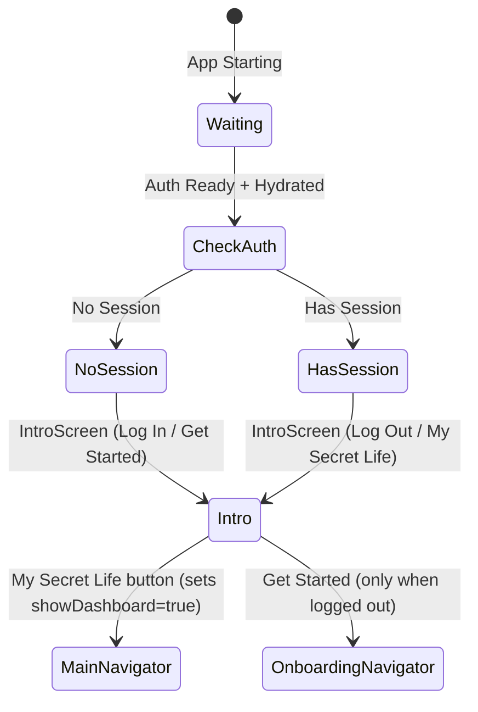
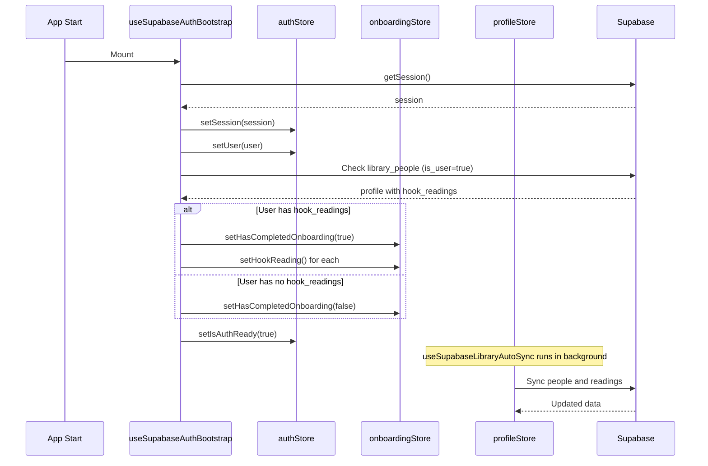
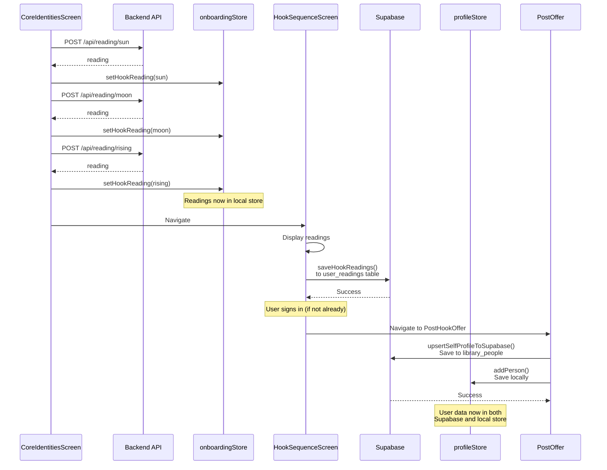
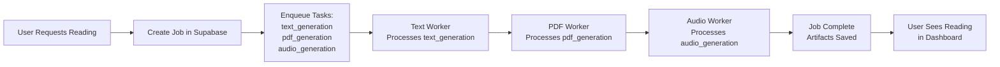

# 1-in-a-Billion - Complete Architecture & UX Documentation

> **Purpose**: This document serves as the **single source of truth** for understanding the complete app flow, navigation logic, state management, data persistence, and screen-by-screen UX. AI agents should reference this document first before making any changes to understand the system architecture.

**Version:** 2.0 (Merged)  
**Last Updated:** January 24, 2026  
**Previous Versions:** ARCHITECTURE.md v1.x + UX_SYSTEM_DOCUMENTATION.md v1.6

---

## Table of Contents

### Part I: Executive Summary & User Flow
1. [Executive Summary](#executive-summary)
2. [App Launch Flow (CRITICAL)](#app-launch-flow-critical)
3. [Complete User Flow](#complete-user-flow)
4. [Navigation Architecture](#navigation-architecture)

### Part II: Screen-by-Screen Reference
5. [Screen Numbering System](#screen-numbering-system)
6. [Onboarding Screens (S1-S9)](#onboarding-screens-s1-s9)
7. [Dashboard Screens (S10+)](#dashboard-screens-s10)
8. [Navigation Flow Maps](#navigation-flow-maps)

### Part III: Technical Architecture
9. [State Management](#state-management)
10. [Data Persistence Flow](#data-persistence-flow)
11. [Backend Architecture](#backend-architecture)
12. [Audio Generation Pipeline](#audio-generation-pipeline)
13. [Product Tiers & Job System](#product-tiers--job-system)

### Part IV: Critical Rules & Debugging
14. [Critical Invariants](#critical-invariants)
15. [Common Pitfalls & Solutions](#common-pitfalls--solutions)
16. [Debugging Guide](#debugging-guide)

---

## Part I: Executive Summary & User Flow

## Executive Summary

### App Purpose
1-in-a-Billion is a comprehensive astrology app that generates personalized readings using 5 different systems (Western, Vedic, Human Design, Gene Keys, Kabbalah). Users can generate readings for themselves and others, compare compatibility, and build a library of astrological insights.

### Tech Stack

**Frontend:**
- React Native with Expo SDK 54
- Zustand for state management
- React Navigation for routing
- React Query (TanStack Query) for API calls
- Supabase Auth for authentication
- AsyncStorage for local persistence

**Backend:**
- Hono.js (Node.js) on Fly.io
- Supabase (Postgres) for database
- Supabase Queue V2 for job processing
- Replicate Chatterbox Turbo for TTS (via Replicate API)
- DeepSeek (primary) / Claude (backup) for LLM
- FFmpeg for audio processing (M4A AAC 96kbps)

### Key Architectural Decisions

1. **Single Source of Truth**: Supabase is the authoritative data store. Local Zustand stores are caches that sync with Supabase.
2. **State-Based Navigation**: Navigation decisions are based on Zustand store state, not URL or screen history.
3. **Intro Gate**: App always lands on Intro; logged-in users must tap **"My Secret Life"** to reach Dashboard.
4. **showDashboard Gate**: `showDashboard` is the only flag that switches to MainNavigator; no auto-dashboard on reopen.
5. **Background Processing**: All heavy operations (reading generation, audio, PDF) happen via Supabase job queue with background workers.
6. **Portraits are Privacy-Preserving Assets**: Uploaded photos are stored separately from generated portraits. The app primarily displays the generated stylized portrait for privacy and consistency.
7. **Audio Format**: M4A (AAC 96kbps) is the primary format. No MP3 fallback. Supports HTTP Range requests for seeking.
8. **Spoken Audio Intro**: All narration audio includes a spoken intro (0.5s silence before/after) with person name, systems, timestamp, and "forbiddenyoga dot com".

### Related Documentation

For detailed specs on specific pipelines, see `1-in-a-billion-backend/docs/`:

| Topic | Document |
|-------|----------|
| Audio/GPU Strategy | `RUNPOD_STRATEGY.md` - Cold starts expected, on-demand GPUs |
| Job Queue | `SUPABASE_QUEUE_ARCHITECTURE.md` - Eventually consistent, stateless workers |
| Scaling | `SCALING_ARCHITECTURE.md` - 0-50 workers auto-scaling |
| Vedic Matching | `VEDIC_MATCHMAKING_SPEC.md` - Ashtakoota scoring, Dosha analysis |
| API Contract | `API_CONTRACT.md` - All endpoints and payloads |
| Song Generation | `SONG_GENERATION_IMPLEMENTATION.md` - MiniMax API integration |
| Portrait Prompting | `src/prompts/image/CLAYMATION_PORTRAIT.md` - internal portrait style prompt (user-facing: "stylized portrait") |
| Couple Image Composition | `src/services/coupleImageService.ts` - sharp composition and caching |
| PDF Layout | `docs/PDF_LAYOUT_SPEC.md` - PDF style and chapter layouts |
| Deployment | `DEPLOYMENT_INSTRUCTIONS.md` - How to deploy to Fly/EAS correctly |

---

## App Launch Flow (CRITICAL)

### How App Routing Works

**When app launches (cold start or reopen):**

1. **No session exists:**
   - → Always goes to `S1_INTRO` (Screen 1)
   - Shows: "Log In" + "Get Started" buttons

2. **Session exists (user is logged in):**
   - → Always goes to `S1_INTRO` (Screen 1)
   - Shows: "Log Out" + "My Secret Life" buttons
   - User must tap **"My Secret Life"** to enter the dashboard
   - **App background/foreground:** `showDashboard` resets on background, so returning always lands on Intro

### The showDashboard Flag

**Authoritative dashboard gate**

- `showDashboard` in `onboardingStore` is the switch from Intro → MainNavigator.
- Routing rule in `RootNavigator` is:
  - **If no session → Intro**
  - **If session exists + showDashboard = false → Intro**
  - **If session exists + showDashboard = true → MainNavigator**

### Sign Out Behavior

- **Location:** Only available on `S1_INTRO` when signed in
- **Warning:** "By signing out you would delete all your user data and history. Are you sure?"
- **Action:** 
  - Deletes ALL data via `DELETE /api/account/purge`
  - Clears all local stores
  - Signs out from Supabase
  - Resets `showDashboard = false`
- **Purpose:** Prevents account switching confusion - if user wants different account, must delete everything first

### Why This Design?

- **Consistency:** Every app launch starts at the same place (Screen 1)
- **Data Safety:** Sign Out = Delete All prevents accidental account mixing
- **User Control:** User explicitly chooses to go to Dashboard via "My Secret Life"
- **Clean State:** App always returns to Intro on reopen, giving user fresh start

---

## Complete User Flow

This is the exact flow a user experiences from signup to dashboard:

```mermaid
flowchart TD
    Start([User Opens App]) --> CheckSession{Has Session?}
    CheckSession -->|No| Intro[IntroScreen<br/>Log In / Get Started]
    CheckSession -->|Yes| IntroLoggedIn[IntroScreen<br/>Log Out / My Secret Life]
    
    Intro --> Relationship[RelationshipScreen]
    Relationship --> BirthInfo[BirthInfoScreen]
    BirthInfo --> Languages[LanguagesScreen]
    Languages --> Account[AccountScreen<br/>Sign Up]
    
    Account --> CreateSession[Create Supabase Session]
    CreateSession --> CoreIdentities
    
    CoreIdentities --> GenerateReadings[Generate Sun/Moon/Rising<br/>via API]
    GenerateReadings --> SaveToStore[Save to onboardingStore.hookReadings]
    SaveToStore --> HookSequence[HookSequenceScreen<br/>Display Readings]
    
    HookSequence --> ShowReadings[User Views Sun/Moon/Rising<br/>Text + Audio]
    ShowReadings --> GatewayPage[Gateway Page<br/>Sign In if needed]
    GatewayPage --> CompleteHook[completeOnboarding called]
    CompleteHook --> PostOffer[PostHookOfferScreen]
    
    PostOffer --> Ask3rdPerson{Generate Free Reading<br/>for 3rd Person?}
    Ask3rdPerson -->|YES| PartnerInfo[PartnerInfoScreen]
    Ask3rdPerson -->|NO| SaveUser[Save User to Supabase<br/>+ Local ProfileStore]
    
    PartnerInfo --> PartnerCoreIdentities[CoreIdentitiesScreen<br/>For Partner]
    PartnerCoreIdentities --> PartnerHookSequence[HookSequenceScreen<br/>For Partner]
    PartnerHookSequence --> SavePartner[Save Partner to Supabase<br/>is_user=false]
    SavePartner --> SaveUser
    
    SaveUser --> SetComplete[Set hasCompletedOnboarding=true]
    SetComplete --> IntroLoggedIn
    IntroLoggedIn --> Dashboard[HomeScreen Dashboard<br/>My Secret Life button]
    
    Dashboard --> ComplexFeatures[All Complexity Begins:<br/>- Reading Generation<br/>- Vedic Matchmaking<br/>- Library Management<br/>- Compatibility Analysis]
```



### Step-by-Step Flow Details

#### 1. User Signs Up (AccountScreen)
- User enters name, email, password
- Creates Supabase auth session via `/api/auth/signup`
- Profile created in `library_people` table with `is_user=true`
- **State**: `hasSession = true`
- **Navigation**: Returns to **IntroScreen** (logged-in state)

#### 2. User Starts Onboarding (Get Started)
- Only **logged-out** users can enter onboarding
- User taps **Get Started** on Intro → Relationship → BirthInfo → Languages → Account → CoreIdentities
- CoreIdentities shows waiting animation (ARTS system - Animated Reasoning Typography System)
- Generates Sun, Moon, Rising readings via API calls:
  - `POST /api/reading/sun`
  - `POST /api/reading/moon`
  - `POST /api/reading/rising`
- Saves readings to `onboardingStore.hookReadings`
- **Critical**: Placements (sunSign, moonSign, risingSign) are calculated and saved during this step
- Navigates to `HookSequenceScreen` when complete

#### 3. HookSequenceScreen Displays Readings
- Shows 3 pages: Sun, Moon, Rising (user can swipe)
- Each page displays:
  - Text reading (intro + main)
  - Audio playback button (pre-generated or generates on-demand)
- Audio is pre-generated during `CoreIdentitiesScreen` in background
- Last page is "gateway" page with sign-in options (if not already signed in)
- When user completes viewing, calls `completeOnboarding()` 
- Navigates to `PostHookOfferScreen`

#### 4. PostHookOfferScreen
- Asks: "Would you like to do a reading for another person?"
- **If YES**: 
  - Calls `safeSaveAndComplete('PartnerInfo')`
  - Sets `redirectAfterOnboarding = 'PartnerInfo'`
  - Completes onboarding → Routes to `PartnerInfoScreen`
- **If NO**: 
  - Calls `safeSaveAndComplete()`
  - Saves user data to Supabase and local ProfileStore
  - Completes onboarding → Returns to Intro (logged-in)
  - User taps **My Secret Life** to enter Dashboard

#### 5. If YES (3rd Person Flow)
- User enters partner birth data in `PartnerInfoScreen`
- Same flow repeats:
  - `CoreIdentitiesScreen` (waiting animation for partner)
  - `HookSequenceScreen` (partner's Sun/Moon/Rising)
- Partner readings saved to `library_people` with `is_user=false`
- Then completes onboarding → Returns to Intro (logged-in) → "My Secret Life" to Dashboard

#### 6. Dashboard (HomeScreen)
- **All complexity begins here**
- Features:
  - Library management (people, readings)
  - Reading generation (Nuclear Package, individual systems)
  - Vedic matchmaking
  - Compatibility analysis
  - Audio/PDF management

---

## Navigation Architecture

### RootNavigator - The Master Router

**Location**: `1-in-a-billion-frontend/src/navigation/RootNavigator.tsx`

The `RootNavigator` is the top-level router that decides which navigator to render based on authentication state and the **Intro gate** (`showDashboard`).



### Routing Logic

```typescript
// Intro is always the landing page
if (!hasSession) {
  return <OnboardingNavigator initialRouteName="Intro" />;
}

// Logged-in users stay on Intro until they tap "My Secret Life"
if (hasSession && showDashboard) {
  return <MainNavigator />;
}

return <OnboardingNavigator initialRouteName="Intro" />;
```

### Navigation Invariants

**CRITICAL RULES - NEVER VIOLATE:**

1. **Intro Gate Is Always First**: App always lands on Intro (logged in or not).
2. **showDashboard Is The Only Dashboard Gate**: Only "My Secret Life" should set `showDashboard = true`.
3. **Onboarding Is Log-Out Only**: Users can only re-enter onboarding after logging out.
4. **Session Presence ≠ Auto Dashboard**: Logged-in users must still pass the Intro gate.
5. **No Profile Check in Routing**: Profile existence does NOT determine routing.
6. **Background Reset**: `showDashboard` resets when app goes to background/inactive.

### OnboardingNavigator Flow

```
Intro → Relationship → BirthInfo → Languages → Account → CoreIdentities → HookSequence → PostHookOffer
```

**Screen Details:**
- **IntroScreen**: Welcome screen, can navigate to SignIn or Relationship
- **RelationshipScreen**: Collects relationship intensity and mode
- **BirthInfoScreen**: Collects birth date, time, city
- **LanguagesScreen**: Collects primary/secondary language
- **AccountScreen**: Sign up screen (creates Supabase session)
- **CoreIdentitiesScreen**: Waiting animation + generates hook readings
- **HookSequenceScreen**: Displays hook readings (Sun/Moon/Rising)
- **PostHookOfferScreen**: Asks about 3rd person reading

### MainNavigator Flow

After onboarding, user enters the main app:
- **HomeScreen**: Dashboard (Control Room)
- **YourChartScreen**: User's chart visualization
- **MatchesScreen**: Compatibility matches
- **MyLibraryScreen**: Saved readings and people
- And 50+ other screens for reading generation, matching, etc.

---

## Part II: Screen-by-Screen Reference

## Screen Numbering System

### ONBOARDING FLOW (Screens 1-9)

**Screen 1: Intro** (`IntroScreen`)
- **Handler:** `S1_INTRO`
- **Purpose:** Welcome screen, app introduction - **ALWAYS the landing page on app launch**
- **Navigation From:** 
  - App launch (always - both signed-in and not signed-in users)
  - App reopen (always returns to Screen 1)
- **Navigation To:** 
  - If **not signed in:**
    - `S2_RELATIONSHIP` ("Get Started" button)
    - `S2_SIGNIN` ("Log In" button)
  - If **signed in:**
    - `S10_HOME` ("My Secret Life" button – legacy wording; in other screens this is now "My Souls Library")
    - Sign Out flow ("Sign Out" button - deletes all data)
- **Backend:** 
  - `DELETE /api/account/purge` - When user confirms Sign Out (deletes all user data)
- **Data Stored:** 
  - `onboardingStore.showDashboard` exists, but routing does not depend on it
  - When "Sign Out" pressed: Deletes all Supabase data + clears local stores
- **Special Behavior:**
- **CRITICAL (current):** Intro is always the landing page. Logged-in users stay on Intro until they tap **"My Secret Life"**.
  - Signed-in users see: "Sign Out" + "My Secret Life" buttons
  - Not signed-in users see: "Log In" + "Get Started" buttons
  - Sign Out shows warning: "By signing out you would delete all your user data and history. Are you sure?"
  - Sign Out is destructive - deletes ALL data to prevent account switching confusion

**Screen 2: Relationship** (`RelationshipScreen`)
- **Handler:** `S2_RELATIONSHIP`
- **Purpose:** Collect relationship intensity (0-10) and mode (sensual/romantic/platonic)
- **Navigation From:** `S1_INTRO`
- **Navigation To:** `S3_BIRTHINFO` (Continue button)
- **Backend:** None
- **Data Stored:** `onboardingStore.relationshipIntensity`, `onboardingStore.relationshipMode`

**Screen 3: Birth Info** (`BirthInfoScreen`)
- **Handler:** `S3_BIRTHINFO`
- **Purpose:** Collect birth date, time, and city (with timezone/lat/lon)
- **Navigation From:** `S2_RELATIONSHIP`
- **Navigation To:** `S4_LANGUAGES` (Continue button)
- **Backend:** 
  - `GET /api/cities/search` - Google Places API for city suggestions
- **Data Stored:** `onboardingStore.birthDate`, `onboardingStore.birthTime`, `onboardingStore.birthCity`

**Screen 4: Languages** (`LanguagesScreen`)
- **Handler:** `S4_LANGUAGES`
- **Purpose:** Select primary language (required) and secondary language (optional), plus importance (0-10)
- **Navigation From:** `S3_BIRTHINFO`
- **Navigation To:** `S5_ACCOUNT` (Continue button)
- **Backend:** None
- **Data Stored:** `onboardingStore.primaryLanguage`, `onboardingStore.secondaryLanguage`, `onboardingStore.languageImportance`

**Screen 5: Account** (`AccountScreen`)
- **Handler:** `S5_ACCOUNT`
- **Purpose:** User signup (Email, Google, Apple) - **Sign-up only screen (post-onboarding)**
- **Navigation From:** `S4_LANGUAGES`
- **Navigation To:** 
  - `S6_CORE_IDENTITIES` (after successful signup)
  - `S1_INTRO` (if signup fails/cancelled)
- **Backend:** 
  - `POST /api/auth/signup` - Email signup
  - Supabase OAuth (Google/Apple) - handled client-side
  - Creates Supabase auth user
- **Data Stored:** 
  - Supabase auth session
  - `authStore.user`, `authStore.session`
  - On signup success, saves onboarding data to Supabase `profiles` table
- **Button Layout:**
  - **Same order as SignInScreen:** Google → Apple → Email (all in same section)
  - Button labels: "Sign up with Google", "Sign up with Apple", "Sign up with Email"
  - Matches SignInScreen layout exactly for consistency

**Screen 6: Core Identities** (`CoreIdentitiesScreen`)
- **Handler:** `S6_CORE_IDENTITIES`
- **Purpose:** Waiting screen - generates Sun/Moon/Rising hook readings and Sun audio
- **Navigation From:** `S5_ACCOUNT` (after signup)
- **Navigation To:** `S7_HOOK_SEQUENCE` (auto-navigate when Sun audio ready)
- **Backend:** 
  - `POST /api/reading/sun?provider=deepseek` - Generate Sun reading
  - `POST /api/reading/moon?provider=deepseek` - Generate Moon reading (parallel)
  - `POST /api/reading/rising?provider=deepseek` - Generate Rising reading (parallel)
  - `POST /api/audio/hook-audio/generate` - Generate Sun audio (stored in Supabase Storage)
- **Data Stored:** 
  - `onboardingStore.hookReadings.sun/moon/rising` (reading text)
  - `onboardingStore.hookAudio.sun` (base64 audio, persisted to AsyncStorage)
  - User placements (sunSign, moonSign, risingSign) saved to `profileStore`
- **Reading Style:**
  - Uses poetic language for degree positions (e.g., "where the sign is still forming itself" instead of "1st decan")
  - Avoids technical jargon like "decan" in favor of natural descriptions
  - Example: "Your Virgo energy emerges at its very point of origin" for 0-10 degrees
- **Fly.io Impact:** 
  - Backend calculates astro placements using Swiss Ephemeris
  - Calls DeepSeek API for LLM text generation with poetic degree descriptions
  - Calls Replicate Chatterbox Turbo for audio generation
  - Uploads audio to Supabase Storage bucket `library` (background, non-blocking)
- **Supabase Impact:** 
  - Uploads audio to `library/hook-audio/{userId}/{personId}/sun.mp3`
  - Background upload (fire-and-forget, non-blocking)
- **PDF Impact:** None (hook readings don't generate PDFs)

**Screen 7: Hook Sequence** (`HookSequenceScreen`)
- **Handler:** `S7_HOOK_SEQUENCE`
- **Purpose:** Interactive carousel showing Sun → Moon → Rising readings with audio playback
- **Navigation From:** `S6_CORE_IDENTITIES` (auto-navigate)
- **Navigation To:** 
  - `S8_POST_HOOK_OFFER` (after viewing all 3 readings)
  - `S5_ACCOUNT` (if user taps sign in on gateway page)
- **Backend:** 
  - `POST /api/audio/hook-audio/generate` - Pre-renders Moon audio (while on Sun page)
  - `POST /api/audio/hook-audio/generate` - Pre-renders Rising audio (while on Moon page)
  - `POST /api/reading/{type}?provider={provider}` - Regenerate readings (if user changes provider)
- **Data Stored:** 
  - `onboardingStore.hookAudio.moon` (URL, pre-rendered)
  - `onboardingStore.hookAudio.rising` (URL, pre-rendered)
- **Fly.io Impact:** 
  - Same as S6 for audio generation (Replicate TTS)
- **Supabase Impact:** 
  - Stores Moon audio at `hook-audio/{userId}/moon.mp3`
  - Stores Rising audio at `hook-audio/{userId}/rising.mp3`
- **PDF Impact:** None

**Screen 8: Post Hook Offer** (`PostHookOfferScreen`)
- **Handler:** `S8_POST_HOOK_OFFER`
- **Purpose:** Ask user if they want to add a partner (3rd person) for compatibility readings
- **Message:** "Add a third person to unlock a free reading and a two person compatibility analysis."
- **Navigation From:** `S7_HOOK_SEQUENCE` (after all 3 readings viewed)
- **Navigation To:** 
  - `S10_HOME` (if "No" - completes onboarding, shows "TRANSFERRING YOU..." with spinner)
  - `S9_PARTNER_INFO` (if "Yes" - via `redirectAfterOnboarding` flag)
- **Backend:** 
  - `POST /api/user-readings` - Saves hook readings to Supabase `user_readings` table
  - Saves user profile to Supabase `library_people` table
  - Uploads hook audio (Sun/Moon/Rising) to Supabase Storage
- **Data Stored:** 
  - `onboardingStore.hasCompletedOnboarding = true`
  - `onboardingStore.redirectAfterOnboarding = 'PartnerInfo'` (if Yes)
  - `onboardingStore.hookAudio` - Persisted to AsyncStorage (survives app restarts)
- **UX Features:**
  - "TRANSFERRING YOU..." loading state with spinner (non-blinking) during dashboard transition
  - Loading state prevents user interaction during data persistence
- **Fly.io Impact:** None
- **Supabase Impact:** 
  - Inserts rows into `user_readings` table (sun, moon, rising)
  - Uploads audio to `library/hook-audio/{userId}/{personId}/{type}.mp3`
  - Creates/updates user profile in `library_people` table
  - Audio URLs already stored in Storage from S6/S7
- **PDF Impact:** None

**Screen 9: Partner Info** (`PartnerInfoScreen`) - Optional
- **Handler:** `S9_PARTNER_INFO`
- **Purpose:** Collect partner's birth info (date, time, city)
- **Navigation From:** `S8_POST_HOOK_OFFER` (if user said Yes)
- **Navigation To:** 
  - `S10_PARTNER_CORE_IDENTITIES` (Continue button)
  - `S10_HOME` (Skip button)
- **Backend:** 
  - `GET /api/cities/search` - Google Places API for city suggestions
- **Data Stored:** 
  - `profileStore.people[]` - Creates new person entry
  - Partner birth data stored locally
- **Fly.io Impact:** None
- **Supabase Impact:** None (stored locally until readings generated)
- **PDF Impact:** None

---

### MAIN DASHBOARD FLOW (Screens 10+)

**Screen 10: Home / Secret Life Dashboard** (`HomeScreen`)
- **Handler:** `S10_HOME`
- **Purpose:** Main dashboard with hook reading carousel, overlay cards, navigation
- **Navigation From:** 
  - `S8_POST_HOOK_OFFER` (onboarding complete)
  - `S9_PARTNER_INFO` (if skipped partner)
  - App launch (if session exists)
- **Navigation To:** 
  - `S11_YOUR_CHART` (Your Chart button)
  - `S12_MY_LIBRARY` (Library button)
  - `S13_MATCHES` (Matches button)
  - `S14_PARTNER_CORE_IDENTITIES` (if partner added from S9)
  - `S15_PERSON_PROFILE` (tap on person card)
  - `S16_SYSTEM_SELECTION` (tap "Get Reading" on overlay card)
  - `S17_AUDIO_PLAYER` (tap play on hook audio)
  - `S18_SETTINGS` (Settings button)
- **Backend:** 
  - `GET /api/jobs/v2/user/:userId/jobs` - Fetch user's jobs (for overlay cards)
  - Reads `hookAudio` from `onboardingStore` (URLs from Supabase Storage)
- **Data Stored:** None (reads from stores)
- **Fly.io Impact:** None (read-only)
- **Supabase Impact:** 
  - Queries `jobs` table for user's completed/processing jobs
  - Reads audio URLs from Storage (already generated in S6/S7)
- **PDF Impact:** None (displays existing PDFs from jobs)

**Screen 12: My Library** (`MyLibraryScreen`)
- **Handler:** `S12_MY_LIBRARY`
- **Purpose:** Browse all saved readings, people, and compatibility overlays
- **Navigation From:** `S10_HOME`
- **Navigation To:** 
  - `S19_PERSON_READINGS` (tap on person)
  - `S20_OVERLAY_READER` (tap on overlay card)
  - `S17_AUDIO_PLAYER` (tap play on audio)
  - `S10_HOME` (Back button)
- **Backend:** 
  - `GET /api/jobs/v2/user/:userId/jobs` - Fetch all user jobs
  - Reads artifacts from Supabase Storage
- **Data Stored:** None
- **Fly.io Impact:** None (read-only)
- **Supabase Impact:** 
  - Queries `jobs` table
  - Reads PDF/audio artifacts from Storage buckets
- **PDF Impact:** Displays PDF download links from Storage
- **CRITICAL DISPLAY RULES - EACH JOB = SEPARATE RECEIPT:**
  - ✅ **Each job must be a separate card** (even if same person/people)
  - ✅ **Jobs are NEVER merged or aggregated**
  - ✅ **Chronological order** (newest first)
  - ❌ **NEVER show one card per person with mixed data from multiple jobs**
  - **Example:** If user generates "Michael (Nuclear)" on Jan 10 and again on Jan 12:
    - Card 1: "Michael - Jan 12, 2026" (newest job)
    - Card 2: "Michael - Jan 10, 2026" (older job)
    - NOT: One "Michael" card showing mixed artifacts from both jobs
  - **Why:** Users may want to compare readings over time, old readings have value (like Audible purchases), new jobs should never "overwrite" old ones

**Screen 19: Person Readings** (`PersonReadingsScreen`)
- **Handler:** `S19_PERSON_READINGS`
- **Purpose:** View all readings for a person (individual or overlay) **FOR A SPECIFIC JOB**
- **Navigation From:** 
  - `S15_PERSON_PROFILE` (View Readings)
  - `S12_MY_LIBRARY` (tap person card - **MUST pass jobId in route params**)
- **Navigation To:** 
  - `S35_DEEP_READING_READER` (tap on reading)
  - `S20_OVERLAY_READER` (tap on overlay)
  - `S17_AUDIO_PLAYER` (tap play)
  - `S10_HOME` (Back button)
- **Backend:** 
  - `GET /api/jobs/v2/:jobId` - Fetch job details
  - `GET /api/jobs/v2/:jobId/tasks` - Fetch task status
- **Data Stored:** None
- **Fly.io Impact:** None (read-only)
- **Supabase Impact:** 
  - Queries `jobs` and `job_tasks` tables
  - Reads artifacts from Storage
- **PDF Impact:** Displays PDF download links
- **CRITICAL: jobId must be passed in route params**
  - ❌ **NEVER use fallback to `person.jobIds[0]`** - this causes old readings to show for new jobs
  - ✅ **Always require explicit jobId from navigation**
  - ✅ **Each job = separate receipt** - user taps a specific job card, sees that job's readings
- **Display Rules:**
  - Only shows readings that have at least one artifact (PDF, audio, or song)
  - Placeholder entries without actual data are hidden
  - If ALL readings are placeholders (job has no artifacts yet), shows placeholders as fallback
- **Button Enabling Rules (CRITICAL):**
  - **PDF Button:** Enabled as soon as PDF artifact is generated (do NOT wait for audio/song)
  - **Audio Button:** Enabled as soon as audio artifact is generated (independent of PDF/song status)
  - **Song Button:** Enabled as soon as song artifact is generated (independent of PDF/audio status)
  - **Progressive Loading:** Each button enables individually when its artifact completes - buttons MUST NOT be greyed out waiting for other artifacts to finish

**Screen 28: Generating Reading** (`GeneratingReadingScreen`)
- **Handler:** `S28_GENERATING_READING`
- **Purpose:** Waiting screen - shows job progress while reading generates
- **Navigation From:** 
  - `S16_SYSTEM_SELECTION` (after selection)
  - `S25_RELATIONSHIP_CONTEXT` (Continue)
  - `S26_PERSONAL_CONTEXT` (Continue)
- **Navigation To:** 
  - `S35_DEEP_READING_READER` (auto-navigate when complete)
  - `S20_OVERLAY_READER` (if overlay, auto-navigate)
  - `S39_JOB_DETAIL` (View Details button)
- **Backend:** 
  - `POST /api/jobs/v2/start` - Start reading generation job
  - `GET /api/jobs/v2/:jobId` - Poll job status
  - `GET /api/jobs/v2/:jobId/tasks` - Poll task progress
- **Data Stored:** 
  - Job ID in navigation params
- **Fly.io Impact:** 
  - **CRITICAL SCREEN** - This triggers the entire generation pipeline:
    1. Backend receives job request
    2. Creates job row in Supabase `jobs` table
    3. Enqueues tasks in Supabase Queue V2 (`job_queue_v2` / `job_tasks`)
    4. Text worker (on Fly.io) claims tasks, calls DeepSeek API
    5. PDF worker (on Fly.io) generates PDFs, uploads to Storage
    6. Audio worker (on Fly.io) generates audio via Replicate, uploads to Storage
- **Supabase Impact:** 
  - Creates `jobs` row with status `processing`
  - Creates `job_tasks` rows (text_generation, pdf_generation, audio_generation)
  - Workers update task status as they complete
  - Final artifacts stored in Storage bucket `job-artifacts` (private)
- **PDF Impact:** 
  - **PDF GENERATION HAPPENS HERE**
  - PDF worker generates PDF from reading text
  - Uploads to Supabase Storage in `job-artifacts` (PDF artifacts)
  - Updates job artifact metadata

---

## Navigation Flow Maps

### Primary Onboarding Flow
```
S1_INTRO → S2_RELATIONSHIP → S3_BIRTHINFO → S4_LANGUAGES → S5_ACCOUNT 
→ S6_CORE_IDENTITIES → S7_HOOK_SEQUENCE → S8_POST_HOOK_OFFER 
→ [S9_PARTNER_INFO (optional)] → S10_HOME
```

### Reading Generation Flow
```
S10_HOME → S15_PERSON_PROFILE → S16_SYSTEM_SELECTION 
→ [S25_RELATIONSHIP_CONTEXT (if overlay)] 
→ [S26_PERSONAL_CONTEXT (if individual)]
→ [S27_VOICE_SELECTION (optional)]
→ S28_GENERATING_READING → S35_DEEP_READING_READER
```

### Partner Onboarding Flow
```
S9_PARTNER_INFO → S14_PARTNER_CORE_IDENTITIES → S22_PARTNER_READINGS 
→ S36_SYNASTRY_PREVIEW → S40_SYNASTRY_OPTIONS → S16_SYSTEM_SELECTION 
→ S28_GENERATING_READING → S20_OVERLAY_READER
```

### Library Browsing Flow
```
S10_HOME → S12_MY_LIBRARY → S19_PERSON_READINGS → S35_DEEP_READING_READER
```

---

## Part III: Technical Architecture

## State Management

### Zustand Stores Overview

The app uses three main Zustand stores, all persisted to AsyncStorage:

1. **authStore**: Authentication state
2. **onboardingStore**: Onboarding progress and hook readings
3. **profileStore**: People library and readings library

### authStore

**Location**: `1-in-a-billion-frontend/src/store/authStore.ts`

**Purpose**: Manages user authentication state.

**State:**
```typescript
{
  user: User | null;           // Supabase user object
  session: Session | null;     // Supabase session
  isLoading: boolean;          // Auth loading state
  isAuthReady: boolean;         // True when bootstrap complete
  displayName: string | null;  // User's display name
  flowType: 'direct_login' | 'onboarding' | null;
}
```

**Key Methods:**
- `setUser(user)`: Set authenticated user
- `setSession(session)`: Set Supabase session
- `signOut()`: Clear session and local state
- `setIsAuthReady(ready)`: Mark auth bootstrap as complete

**Persistence**: Only persists `displayName` and `freeOverlayUsedByUserId`. User/session are rehydrated from Supabase on app start.

**Bootstrap**: `useSupabaseAuthBootstrap` hook rehydrates session from Supabase on app start.

### onboardingStore

**Location**: `1-in-a-billion-frontend/src/store/onboardingStore.ts`

**Purpose**: Manages onboarding progress, hook readings, and user input during onboarding.

**State:**
```typescript
{
  // User input
  name?: string;
  birthDate?: string;
  birthTime?: string;
  birthCity?: CityOption;
  relationshipIntensity: number;
  relationshipMode: RelationshipMode;
  primaryLanguage?: LanguageOption;
  
  // Hook readings (generated during CoreIdentitiesScreen)
  hookReadings: Partial<Record<'sun' | 'moon' | 'rising', HookReading>>;
  hookAudio: Partial<Record<'sun' | 'moon' | 'rising', string>>; // base64 audio
  
  // Critical flag
  hasCompletedOnboarding: boolean;  // ← THE KEY FLAG
  
  // Dashboard gate
  showDashboard: boolean; // ← THE DASHBOARD GATE
  
  // People & readings library (also in profileStore)
  people: PersonProfile[];
  readings: ReadingRecord[];
}
```

**Key Methods:**
- `setHookReading(reading)`: Save a hook reading (sun/moon/rising)
- `setHookAudio(type, audioBase64)`: Save hook audio
- `completeOnboarding()`: Set `hasCompletedOnboarding = true`
- `setHasCompletedOnboarding(value)`: Direct setter (used by bootstrap)
- `setShowDashboard(value)`: Control dashboard gate

**Onboarding Progress Flag**: `hasCompletedOnboarding`
- Tracks onboarding completion only
- Does **not** auto-route to Dashboard
- Dashboard is gated by `showDashboard` (Intro → "My Secret Life")

**Persistence**: Fully persisted to AsyncStorage. Rehydrated on app start.

### profileStore

**Location**: `1-in-a-billion-frontend/src/store/profileStore.ts`

**Purpose**: Manages people library (user + partners) and readings library.

**State:**
```typescript
{
  people: PersonProfile[];      // All people (user + partners)
  readings: ReadingRecord[];     // All generated readings
  savedAudio: SavedAudio[];      // Saved audio files
  savedPDFs: SavedPDF[];         // Saved PDF files
}
```

**Key Methods:**
- `addPerson(person)`: Add person to library
- `updatePerson(id, updates)`: Update person data
- `getUser()`: Get main user (isUser=true)
- `addReading(reading)`: Add reading to library

**Sync**: `useSupabaseLibraryAutoSync` hook keeps this in sync with Supabase `library_people` table.

**Persistence**: Fully persisted to AsyncStorage.

### State Synchronization Flow



---

## Data Persistence Flow

### Supabase Tables

**Primary Tables:**

1. **`library_people`**: Stores all people (user + partners)
   - `id`, `user_id`, `name`, `birth_data` (JSON), `placements` (JSON), `hook_readings` (JSON), `is_user` (boolean)
   - `is_user=true`: Main user
   - `is_user=false`: Partners/3rd persons

2. **`user_readings`**: Stores hook readings (Sun/Moon/Rising)
   - `user_id`, `type` (sun/moon/rising), `sign`, `intro`, `main`, `audio_base64`

3. **`jobs`**: Job queue for reading generation
   - `id`, `user_id`, `type`, `status`, `progress`, `artifacts` (JSON)

4. **`assistant_config`**: API keys storage
   - `key`, `value` (encrypted)

### Data Flow: Hook Readings



### Data Flow: User Profile

**When User Completes Onboarding:**

1. **PostHookOfferScreen** calls `safeSaveAndComplete()`
2. **Local Save**: `profileStore.addPerson()` - saves to local Zustand store
3. **Cloud Save**: `upsertSelfProfileToSupabase()` - saves to Supabase `library_people` table
4. **Data Saved**:
   - Name, email
   - Birth data (date, time, city, timezone, coordinates)
   - Placements (sunSign, moonSign, risingSign)
   - Hook readings (as JSON)
   - Relationship mode and intensity

### Data Flow: 3rd Person Reading

**If User Says YES to 3rd Person:**

1. **PostHookOfferScreen** sets `redirectAfterOnboarding = 'PartnerInfo'`
2. **PartnerInfoScreen**: User enters partner birth data
3. **CoreIdentitiesScreen**: Generates partner's hook readings
4. **HookSequenceScreen**: Displays partner's readings
5. **Save Partner**: 
   - `profileStore.addPerson()` with `isUser=false`
   - `upsertPartnerProfileToSupabase()` to `library_people` with `is_user=false`

### Local vs Cloud Strategy

**Local (AsyncStorage/Zustand):**
- Immediate UI access
- Offline capability
- Fast reads/writes
- Used for: onboarding state, hook readings during onboarding, people/readings library cache

**Cloud (Supabase):**
- Authoritative source of truth
- Cross-device sync
- Backup and recovery
- Used for: user profiles, hook readings (final), all generated readings, jobs

**Sync Strategy:**
- **Write**: Always write to both local and cloud
- **Read**: Read from local first, sync with cloud in background
- **Conflict Resolution**: Cloud wins (Supabase is source of truth)

---

## Backend Architecture

### Server Structure

**Location**: `1-in-a-billion-backend/src/server.ts`

**Main Components:**
- Hono.js app with CORS middleware
- Route handlers for all API endpoints
- Background workers (text, audio, PDF, song)
- API key preloader

### API Endpoints

```
/api/reading/*          - Hook reading generation (sun/moon/rising)
/api/jobs/*             - Job creation and status
/api/auth/*             - Authentication (signup, signin, password reset)
/api/account/*          - Account management (delete)
/api/vedic/*            - Vedic matchmaking
/api/vedic-v2/*         - Vedic matchmaking v2 (vectorized)
/api/audio/*            - Audio generation
/api/pdf/*              - PDF generation
/api/voices/*           - Voice management
/api/admin/*            - Admin endpoints
```

### Job Queue System

**Location**: Supabase `jobs` table

**Process:**
1. Frontend creates job via `POST /api/jobs`
2. Backend enqueues tasks in `job_tasks` table
3. Workers poll `job_tasks` table for pending tasks
4. Workers process tasks and update status
5. Frontend polls job status via `GET /api/jobs/:id`

**Task Types:**
- `text_generation`: LLM text generation
- `pdf_generation`: PDF creation
- `audio_generation`: TTS audio generation
- `song_generation`: Music + lyrics generation

**Workers:**
- **TextWorker**: Runs on Fly.io, processes text tasks
- **AudioWorker**: Runs on Fly.io, processes audio tasks (calls Replicate API)
- **PDFWorker**: Runs on Fly.io, processes PDF tasks
- **SongWorker**: Runs on Fly.io, processes song tasks

---

## Audio Generation Pipeline

### Audio Format Strategy

**Primary Format: M4A (AAC 96kbps)**
- No MP3 fallback
- Smaller file size than MP3
- Better quality at lower bitrate
- Supports HTTP Range requests (seeking/scrubbing)
- Used by Audible and most streaming services

### Audio Intro Feature

**All narration audio includes a spoken intro:**

**Template (Individual Reading):**
```
This audio is an introduction to a personalized soul reading for [Person Name], 
created through the lens of [Western Astrology, Vedic Astrology, Human Design, Gene Keys, Kabbalah]. 
The reading was generated on [January 24th, 2026] by the One in a Billion app 
and is powered by forbiddenyoga dot com.
```

**Template (Synastry Reading):**
```
This audio is an introduction to a personalized synastry reading for [Person 1] and [Person 2], 
created through the lens of [Western Astrology, Vedic Astrology, Human Design, Gene Keys, Kabbalah]. 
The reading was generated on [January 24th, 2026] by the One in a Billion app 
and is powered by forbiddenyoga dot com.
```

**Implementation:**
- Location: `1-in-a-billion-backend/src/workers/audioWorker.ts`
- 0.5 seconds silence before intro
- Intro spoken by same voice as narration
- 0.5 seconds silence after intro
- Intro is NOT written in PDF (audio-only)
- Date format: "January 24th, 2026" (ordinal suffix: st/nd/rd/th)
- Systems: Always uses full names (Western Astrology, Vedic Astrology, Human Design, Gene Keys, Kabbalah)
- Domain: "forbiddenyoga dot com" (spoken, not written)

**Code Structure:**
```typescript
const INTRO_SILENCE_SEC = 0.5;
const INTRO_SYSTEM_NAMES: Record<string, string> = {
  western: 'Western Astrology',
  vedic: 'Vedic Astrology',
  human_design: 'Human Design',
  gene_keys: 'Gene Keys',
  kabbalah: 'Kabbalah',
};

function buildIntroText(params: {
  person1Name: string;
  person2Name?: string | null;
  systems: string[];
  isSynastry: boolean;
  timestamp: Date;
}): string {
  // Returns intro text based on template
}

function buildSilenceWav(durationSec: number, sampleRate = 24000, numChannels = 1): Buffer {
  // Generates silent WAV buffer
}
```

### Hook Audio Pre-Rendering (CRITICAL)

**Purpose**: Pre-render all 3 hook audios (Sun, Moon, Rising) during the waiting screen so audio plays instantly when user taps play.

**Implementation:**

| Screen | Store | Behavior |
|--------|-------|----------|
| `CoreIdentitiesScreen` (1st person) | `onboardingStore.hookAudio` | Waits for ALL 3 audios before navigating |
| `PartnerCoreIdentitiesScreen` (3rd person) | `onboardingStore.partnerAudio` | Waits for ALL 3 audios before navigating |

**Flow:**
1. During waiting animation, start generating Sun reading + audio
2. When Sun screen shows, start Moon reading + audio in background
3. When Moon screen shows, start Rising reading + audio in background
4. **CRITICAL**: Before navigating to HookSequence/PartnerReadings, await ALL audio promises
5. Status text shows: "Giving your reading a voice…" → "All readings ready!"

**Why this matters:**
- Without pre-rendering: User taps play → sees loading spinner → waits 5-10s for TTS
- With pre-rendering: User taps play → audio plays instantly

**Fallback:**
- If audio generation fails, the destination screen (`HookSequenceScreen` / `PartnerReadingsScreen`) has fallback logic to generate audio on-demand
- This is a degraded UX but ensures the app doesn't break

**Code locations:**
- `1-in-a-billion-frontend/src/screens/onboarding/CoreIdentitiesScreen.tsx` (lines 619-691)
- `1-in-a-billion-frontend/src/screens/home/PartnerCoreIdentitiesScreen.tsx` (lines 500-520)

---

### Replicate Integration

**Purpose**: Audio generation via Chatterbox Turbo TTS

**Process:**
1. Audio task created in `job_tasks`
2. AudioWorker claims task
3. Generates intro text (if narration)
4. Chunks text into 500-char segments
5. Sends each chunk to Replicate API
6. Receives WAV audio buffers
7. Concatenates WAV chunks (with intro if present)
8. Converts to M4A (AAC 96kbps) with loudnorm filter
9. Saves to Supabase Storage
10. Updates job with audio artifact

**Audio Processing:**
- Input: Text chunks (500 chars max)
- TTS: Replicate Chatterbox Turbo
- Output: WAV (24kHz, mono, 16-bit PCM)
- Conversion: FFmpeg (loudnorm + AAC 96k)
- Final: M4A (AAC 96kbps)

---

## Product Tiers & Job System

### Product Tiers

The app offers 3 reading packages. **Every document produces 4 outputs**: text + PDF + audio + song.

| Package | Documents | Texts | PDFs | Audios | Songs | Job Type |
|---------|-----------|-------|------|--------|-------|----------|
| **Single Reading** | 1 | 1 | 1 | 1 | 1 | `extended` |
| **Combined Package** | 5 | 5 | 5 | 5 | 5 | `extended` |
| **Nuclear Package** | 16 | 16 | 16 | 16 | 16 | `nuclear_v2` |

#### Document Output Pipeline (per document)
```
Text (LLM) → PDF (generated) → Audio (Chatterbox TTS) → Song (MiniMax)
```
Each document's text is:
1. Converted to PDF
2. Converted to audio (TTS narration with intro)
3. Sent to LLM for lyrics → MiniMax for personalized song

#### Single Reading (1 document)
- User buys one system reading (e.g., "Vedic for Michael")
- Backend: `extended` job with `systems: ['vedic']`
- Outputs: 1 text + 1 PDF + 1 audio + **1 song**
- Library shows: **"Michael"** → 1 of each

#### Combined Package (5 documents)
- User buys all 5 systems for themselves
- Backend: `extended` job with `systems: ['western', 'vedic', 'human_design', 'gene_keys', 'kabbalah']`
- Outputs: 5 texts + 5 PDFs + 5 audios + **5 songs**
- Library shows: **"Michael"** → 5 of each
- Frontend: `CompleteReadingScreen.tsx`

#### Nuclear Package (16 documents)
- User buys complete relationship analysis for 2 people
- Backend: `nuclear_v2` job
- Outputs: 16 texts + 16 PDFs + 16 audios + **16 songs**
- Library shows 3 entries:
  - **"Michael"** → 5 documents (each with text/PDF/audio/song)
  - **"Charmaine"** → 5 documents (each with text/PDF/audio/song)
  - **"Shared Karma"** → 6 documents (each with text/PDF/audio/song)

```
Nuclear Package Document Structure:
├── Person 1: docs 1-5 (5 systems × 4 outputs = 20 files)
├── Person 2: docs 6-10 (5 systems × 4 outputs = 20 files)
└── Overlay: docs 11-16 (6 docs × 4 outputs = 24 files)
Total: 16 documents × 4 outputs = 64 files
```

#### Song Generation Cost
- MiniMax: ~$0.08 per song
- Single: $0.08
- Combined: $0.40 (5 songs)
- Nuclear: $1.28 (16 songs)

### Reading Generation Pipeline



**Job Types:**
- `extended`: Individual reading (1-5 systems for 1 person)
- `nuclear_v2`: Complete 16-document reading (2 people + overlay)
- `synastry`: Single overlay reading (2 people, 1 system)
- `text_generation`: Generate text for a system
- `pdf_generation`: Generate PDF document
- `audio_generation`: Generate audio (TTS)
- `song_generation`: Generate personalized song

**Workers:**
- **TextWorker**: Processes text generation tasks (calls DeepSeek/Claude)
- **PDFWorker**: Generates PDFs from text (with image optimization)
- **AudioWorker**: Generates audio via Replicate (Chatterbox Turbo)
- **SongWorker**: Generates songs via MiniMax API

---

## Part IV: Critical Rules & Debugging

## Critical Invariants

### Navigation Invariants

**INVARIANT 1: Intro Gate Is Always First**
- App always lands on Intro (logged in or not)
- Logged-in users must tap **"My Secret Life"** to reach Dashboard

**INVARIANT 2: showDashboard Is the Dashboard Gate**
- `showDashboard = true` is the ONLY flag that routes to MainNavigator
- `showDashboard` is set by the Intro "My Secret Life" button
- `showDashboard` resets when app goes to background/inactive

**INVARIANT 3: Onboarding Is Log-Out Only**
- Users can only re-enter onboarding after logging out
- Logged-in users do not auto-resume onboarding steps

**INVARIANT 4: No Profile Check in Routing**
- Profile existence in Supabase does NOT determine routing
- Routing is controlled by `hasSession` + `showDashboard`

### State Management Invariants

**INVARIANT 5: Supabase is Source of Truth**
- Supabase database is authoritative
- Local Zustand stores are caches
- On conflict, Supabase wins

**INVARIANT 6: Onboarding Store Persistence**
- `onboardingStore` is fully persisted to AsyncStorage
- Hook readings are saved locally during onboarding
- After onboarding, hook readings are synced to Supabase

**INVARIANT 7: Auth Store Minimal Persistence**
- `authStore` only persists `displayName` and `freeOverlayUsedByUserId`
- User and session are rehydrated from Supabase on app start
- Never manually persist user/session objects

### Data Consistency Invariants

**INVARIANT 8: Dual Write Strategy**
- Always write to both local store and Supabase
- Local write for immediate UI update
- Cloud write for persistence and sync

**INVARIANT 9: Hook Readings Save Points**
- Hook readings saved to `onboardingStore` during CoreIdentitiesScreen
- Hook readings saved to Supabase `user_readings` table during HookSequenceScreen (after sign-in)
- Hook readings saved to `library_people.hook_readings` during PostHookOfferScreen

**INVARIANT 10: Audio Format**
- All audio is M4A (AAC 96kbps)
- No MP3 fallback
- All narration audio includes spoken intro

**INVARIANT 11: One Free Third Person Hook Reading**
- Users can only create ONE free third person hook reading during onboarding
- Check: `people.find((p) => !p.isUser && p.hookReadings && p.hookReadings.length === 3)`
- Enforced in: `AddThirdPersonPromptScreen` (redirects to existing) and `PartnerInfoScreen` (blocks creation)
- After onboarding, users can add unlimited people (paid feature)

**INVARIANT 11: Job Buffer (40-job cap)**
- Frontend maintains max 40 job receipts in AsyncStorage
- Oldest jobs auto-deleted when limit exceeded
- Associated local media (PDFs, audio, songs) deleted with job

---

## Common Pitfalls & Solutions

### Pitfall 1: Auto-routing to Dashboard on Reopen

**Symptom**: Logged‑in users return to the Dashboard instead of Intro.

**Root Cause**: Routing logic bypasses the Intro gate (showDashboard).

**Solution**: Only allow MainNavigator when `showDashboard = true` (set by Intro "My Secret Life"), and reset `showDashboard` on background.

**File**: `1-in-a-billion-frontend/src/navigation/RootNavigator.tsx`

### Pitfall 2: Infinite Navigation Loop

**Symptom**: App keeps re-rendering and navigating between screens.

**Root Cause**: `useEffect` dependencies include Zustand setters, causing infinite re-runs.

**Solution**: Remove Zustand setters from dependency arrays. Setters are stable and don't need to be dependencies:
```typescript
// BAD
useEffect(() => {
  setUser(user);
}, [user, setUser]);

// GOOD
useEffect(() => {
  setUser(user);
}, [user]);
```

**File**: `1-in-a-billion-frontend/src/hooks/useSupabaseAuthBootstrap.ts`

### Pitfall 3: Missing Waiting Animation

**Symptom**: User doesn't see the beautiful ARTS waiting animation, goes straight to HookSequence.

**Root Cause**: RootNavigator routes to `HookSequence` if `hasHookReadings = true`, skipping `CoreIdentitiesScreen`.

**Solution**: Always route to `CoreIdentitiesScreen` first if `!hasCompletedOnboarding`. CoreIdentitiesScreen will quickly navigate to HookSequence if readings already exist.

**File**: `1-in-a-billion-frontend/src/navigation/RootNavigator.tsx`

### Pitfall 4: Hook Readings Not Persisting

**Symptom**: Hook readings disappear after app restart.

**Root Cause**: Readings only saved to `onboardingStore`, not to Supabase.

**Solution**: Ensure readings are saved to Supabase:
1. During HookSequenceScreen: Save to `user_readings` table
2. During PostHookOfferScreen: Save to `library_people.hook_readings`

**Files**: 
- `1-in-a-billion-frontend/src/services/userReadings.ts`
- `1-in-a-billion-frontend/src/services/profileUpsert.ts`

### Pitfall 5: State Not Syncing with Supabase

**Symptom**: Changes made in app don't appear in Supabase, or vice versa.

**Root Cause**: Not using sync hooks or not calling sync functions.

**Solution**: 
- Use `useSupabaseLibraryAutoSync` hook for profileStore
- Call `upsertSelfProfileToSupabase()` after onboarding
- Call `upsertPartnerProfileToSupabase()` for partners

**Files**:
- `1-in-a-billion-frontend/src/hooks/useSupabaseLibraryAutoSync.ts`
- `1-in-a-billion-frontend/src/services/profileUpsert.ts`

### Pitfall 6: Fly Deploy from Wrong Folder

**Symptom**: Fly deploy takes 10+ minutes and uploads 245 MB.

**Root Cause**: Running `fly deploy` from parent folder instead of `1-in-a-billion-backend/`.

**Solution**: Always run from backend folder:
```bash
cd 1-in-a-billion-backend
fly deploy
```

**File**: `DEPLOYMENT_INSTRUCTIONS.md`

---

## Debugging Guide

### Debugging Navigation Issues

**Step 1**: Check RootNavigator logs
```typescript
console.log('🧭 RootNavigator State:', {
  hasSession,
  showDashboard,
  hasCompletedOnboarding,
  isHydrated
});
```

**Step 2**: Check Bootstrap logs
```typescript
// In useSupabaseAuthBootstrap
console.log('✅ Bootstrap: User has profile AND hook readings - marking onboarding complete');
// or
console.log('🔄 Bootstrap: User has profile but no hook readings - onboarding incomplete');
```

**Step 3**: Check OnboardingStore state
```typescript
const state = useOnboardingStore.getState();
console.log('Onboarding State:', {
  hasCompletedOnboarding: state.hasCompletedOnboarding,
  showDashboard: state.showDashboard,
  hookReadings: state.hookReadings
});
```

### Debugging State Issues

**Step 1**: Check AsyncStorage
```typescript
import AsyncStorage from '@react-native-async-storage/async-storage';
const onboarding = await AsyncStorage.getItem('onboarding-storage');
console.log('Persisted onboarding:', JSON.parse(onboarding));
```

**Step 2**: Check Supabase
```sql
-- Check if user has hook readings
SELECT hook_readings FROM library_people WHERE user_id = 'USER_ID' AND is_user = true;

-- Check user_readings table
SELECT * FROM user_readings WHERE user_id = 'USER_ID';
```

**Step 3**: Clear and Reset
```typescript
// Clear all stores
useOnboardingStore.getState().reset();
useAuthStore.getState().signOut();
useProfileStore.getState().reset();
```

### Debugging Audio Issues

**Check audio artifacts:**
```sql
-- Check job artifacts
SELECT artifacts FROM jobs WHERE id = 'JOB_ID';

-- Check audio files in Storage
SELECT * FROM storage.objects WHERE bucket_id = 'job-artifacts' AND name LIKE '%audio%';
```

**Check audio worker logs:**
```bash
# On Fly.io
fly logs -a 1-in-a-billion-backend --region sin
```

---

## Conclusion

This architecture document serves as the single source of truth for understanding the 1-in-a-Billion app. When making changes:

1. **Read this document first** to understand the flow
2. **Check the Critical Invariants** to ensure you don't violate them
3. **Reference the Common Pitfalls** to avoid known issues
4. **Update this document** if you change the architecture

**Key Takeaways:**
- Navigation is state-based, not URL-based
- `showDashboard` is the ONLY flag for Dashboard vs Intro
- Supabase is the source of truth, local stores are caches
- Always write to both local and cloud
- Hook readings are the "key" to unlock the dashboard
- All narration audio includes spoken intro (0.5s silence before/after)
- Audio format is M4A (AAC 96kbps), no MP3 fallback
- Each job = separate receipt (never aggregate jobs)

---

**Last Updated**: January 24, 2026  
**Maintainer**: Update this document when architecture changes  
**Previous Files Merged**: ARCHITECTURE.md + UX_SYSTEM_DOCUMENTATION.md

